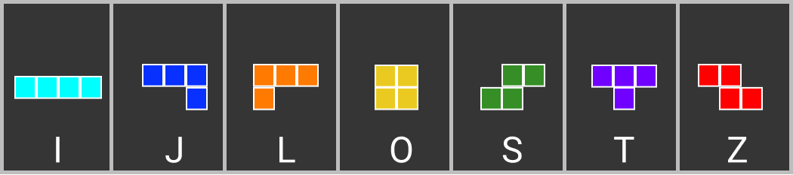
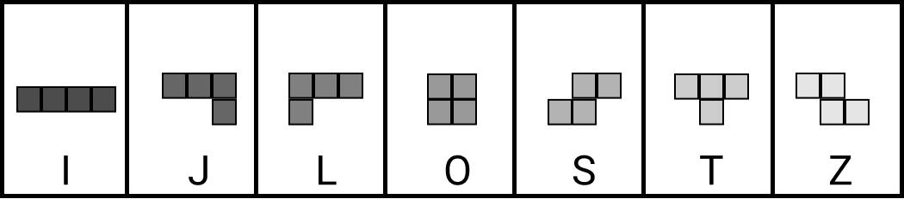
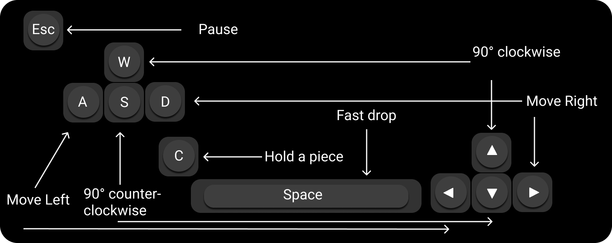

# Tetris


Tetris is a tile-matching puzzle video game originally designed and programmed by Soviet Russian software engineer Alexey Pajitnov. The first playable version was completed on June 6, 1984, while he was working for the Dorodnitsyn Computing Centre of the Academy of Sciences of the Soviet Union in Moscow. He derived its name from combining the Greek numerical prefix tetra- (the falling pieces contain 4 segments) and tennis, Pajitnov's favorite sport. The name is also used in-game to refer to the play where four lines are cleared at once.

Tetris was the first game to be exported from the Soviet Union to the United States, where it was published by Spectrum HoloByte for the Commodore 64 and IBM PC. The game is a popular use of tetrominoes, the four-element case of polyominoes, which have been used in popular puzzles since at least 1907 (Source: Wikipedia)

## Types of Tetriminos

---

</br>

Multicolor


Monochrome


## Controls

---

</br>



## Game Rules

---

</br>

## Getting Started

---

</br>

```bash
node app.js
```

Open `http://localhost:3000` with your browser to play Tetris
